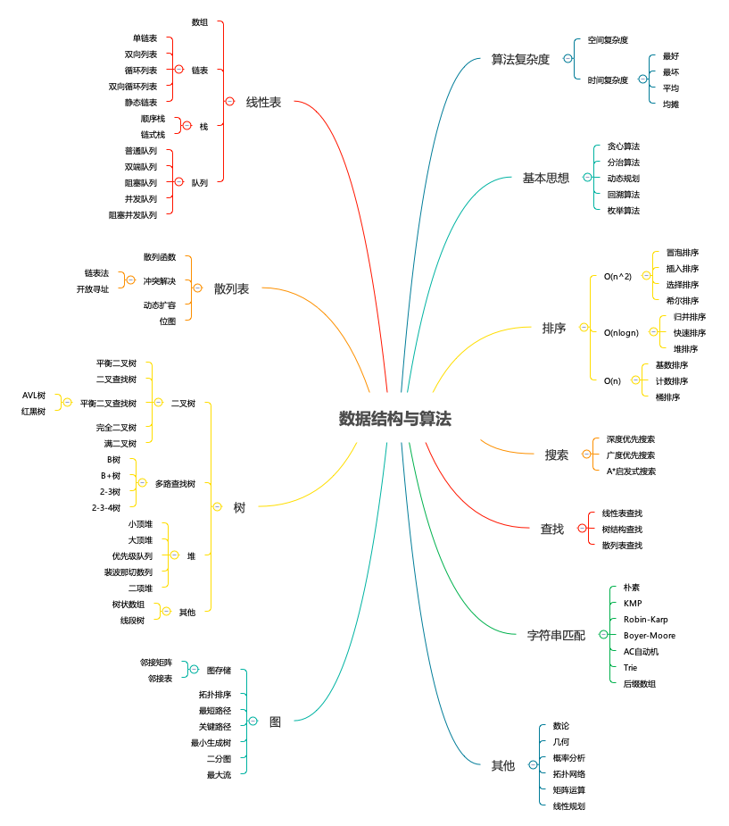

# algorithms
日常算法训练

## 包含的内容

## 排序类
- 001-冒泡排序 [python版本](src/python/001.py) [go版本](src/golang/001.go)
- 002-插入排序 [python版本](src/python/002.py) [go版本](src/golang/002.go)
- 003-选择排序 [python版本](src/python/003.py) [go版本](src/golang/003.go)
- 004-希尔排序 [python版本](src/python/004.py) [go版本](src/golang/004.go)
- 005-归并排序 [python版本](src/python/005.py) [go版本](src/golang/005.go)
- 006-快速排序 [python版本](src/python/006.py) [go版本](src/golang/006.go)
- 007-计数排序 [python版本](src/python/007.py) [go版本](src/golang/007.go)
- 008-基数排序 [python版本](src/python/008.py) [go版本](src/golang/008.go)
- 009-桶排序   [python版本](src/python/009.py) [go版本](src/golang/009.go) 
- 010-堆排序   [python版本](src/python/010.py) [go版本](src/golang/010.go) 
